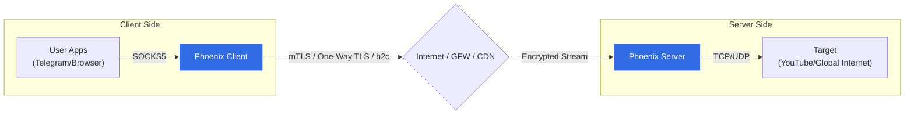

<div align="center">
  
  <h1>Phoenix</h1>
  <p>
    
    
    
    
  </p>
  <p><strong>Phoenix</strong> is a high-performance, resilient tunneling tool designed to bypass DPI and severe network censorship using <strong>HTTP/2 (h2/h2c)</strong> multiplexing.</p>

  [🇮🇷 Read in Persian (فارسی) 🇮🇷](README-fa.md) | [📚 Full Documentation (Docs)](docs/index.md)
</div>

---

## 🚀 Features at a Glance

- **Protocol Obfuscation:** Uses standard **HTTP/2** (h2) or **h2c** (Cleartext) to blend in with normal web traffic.
- **Advanced Security Modes:**
  - **mTLS (Mutual TLS):** High-security mode requiring client certificates.
  - **One-Way TLS:** HTTPS-like encrypted tunnel (Server authenticated, Client anonymous).
  - **h2c (Cleartext):** Stealth mode for use behind CDNs or reverse proxies.
- **Resilience:**
  - **Zombie Connection Recovery:** Auto-detects dead connections and performs a "Hard Reset" to restore connectivity instantly.
  - **Circuit Breaker:** Prevents "Reset Storms" during network flapping.
- **High Performance:** Multiplexes thousands of streams over a single TCP connection, reducing latency.
- **Cross-Platform:** Native binaries for **Linux, Windows, macOS, and Android** (amd64/arm64).

## 🛠 Architecture

Phoenix establishes a persistent HTTP/2 connection. All user traffic (SOCKS5/HTTP) is encapsulated into HTTP/2 DATA frames.



## ⚡ Getting Started

### 1. Installation

Download the latest binary from the [Releases Page](https://github.com/Selin2005/phoenix/releases).

**Linux/macOS:**
```bash
chmod +x phoenix-client-linux-amd64
chmod +x phoenix-server-linux-amd64
```

**Windows:**
Just run `phoenix-client-windows-amd64.exe`.

### 2. Key Generation (For Secure Mode)
Generate highly secure **Ed25519** keys using the buil-in generator:

```bash
# On Server
./phoenix-server-linux-amd64 -gen-keys
# Output: private.key (file) and Public Key (stdout)

# On Client (Only for mTLS)
./phoenix-client-linux-amd64 -gen-keys
# Output: client_private.key (file) and Public Key (stdout)
```

### 3. Configuration

#### **Server (`config.toml`)**
```toml
listen_addr = ":443"

[security]
enable_socks5 = true
enable_udp = true

# Path to Server Private Key (generated above) for TLS
private_key = "private.key"

# List of authenticated client Public Keys (mTLS).
# Leave empty for One-Way TLS (allow any client).
authorized_clients = [
  "CLIENT_PUBLIC_KEY_BASE64..."
]
```

#### **Client (`client.toml`)**
```toml
remote_addr = "YOUR_SERVER_IP:443"

# Server's Public Key (REQUIRED for TLS) to prevent MITM.
server_public_key = "SERVER_PUBLIC_KEY_BASE64..."

# Client's Private Key (Optional - Only for mTLS).
# If commented out, One-Way TLS is used.
# private_key = "client_private.key"

[[inbounds]]
protocol = "socks5"
local_addr = "127.0.0.1:1080"
```

### 4. Running

**Server:**
```bash
./phoenix-server -c config.toml
```

**Client:**
```bash
./phoenix-client -c client.toml
```

## 📚 Documentation
For deeper dives into architecture and advanced configuration, read the full documentation:

- [Architecture & Protocol Design](docs/guide/architecture.md)
- [Detailed Configuration Guide](docs/guide/configuration.md)
- [Security Model & Threat analysis](docs/guide/security.md)

## ❤️ Support
Maintained by **FoxFig Team**.
Dedicated to Internet Freedom. 🕊️
