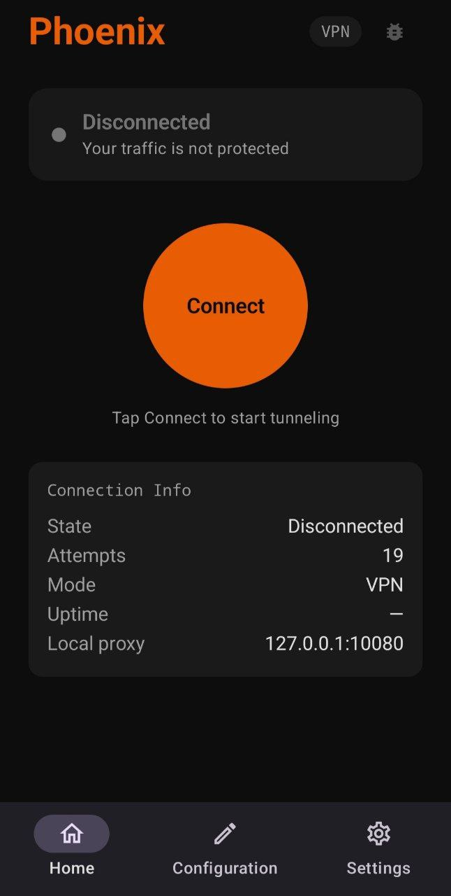
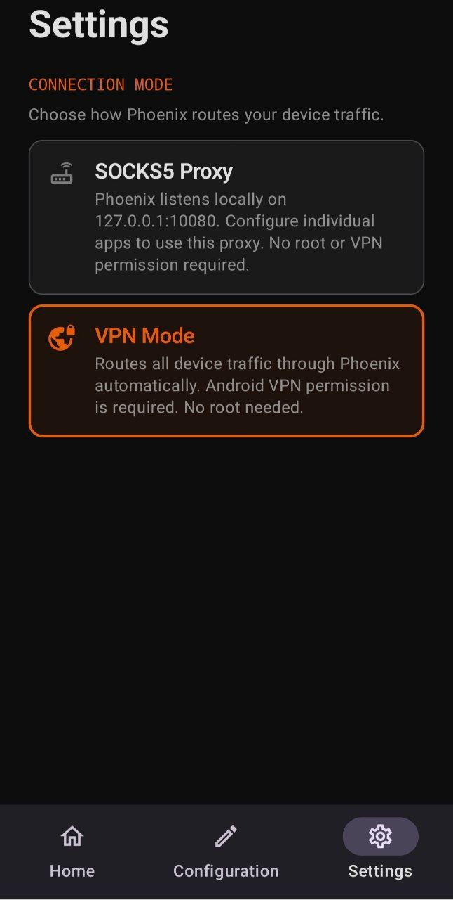

<div align="center">
  
  <h1>Phoenix Android</h1>
  <p>
    
    
    
    
    <a href="https://github.com/dondiego2020/phoenix-android/releases"></a>
  </p>
  <p>
    Native Android client for <a href="https://github.com/Fox-Fig/phoenix"><strong>Phoenix</strong></a><br>
    Bypass censorship and DPI — no root required.
  </p>

  [📦 Download APK](https://github.com/dondiego2020/phoenix-android/releases) · [🖥️ Main Project](https://github.com/Fox-Fig/phoenix) · [📚 Documentation](https://Fox-Fig.github.io/phoenix/)

</div>

---

## Screenshots

<div align="center">
  
  &nbsp;&nbsp;&nbsp;
  
</div>

---

## What is Phoenix?

[Phoenix](https://github.com/Fox-Fig/phoenix) is a high-performance tunneling tool built by the [FoxFig Team](https://t.me/FoxFig) that bypasses Deep Packet Inspection (DPI) and severe network censorship by wrapping traffic inside **HTTP/2** connections. It supports mTLS mutual authentication, one-way TLS, and h2c for CDN deployments.

This repository is the **official Android client** for Phoenix. It connects your Android device to a Phoenix server and routes your traffic through it — no root required.

> **Need a server?** See the [Phoenix server setup guide](https://Fox-Fig.github.io/phoenix/guide/getting-started).

---

## Features

- **VPN mode** — routes *all* device traffic transparently via Android `VpnService` + tun2socks; no per-app setup needed
- **SOCKS5 proxy mode** — local proxy on `127.0.0.1:10080`; configure individual apps manually
- **mTLS authentication** — Ed25519 mutual auth with on-device key generation; no key ever leaves your device
- **One-way TLS** — pin the server certificate without client auth
- **h2c mode** — cleartext HTTP/2 for CDN-fronted deployments
- **Live debug logs** — swipe from the left edge or tap the bug icon to inspect tunnel output in real time
- **Background service** — Foreground Service survives Doze mode and app minimization
- **No root required**

---

## Requirements

| | Minimum |
|---|---|
| Android | 8.0 (API 26) |
| Architecture | ARM64 (arm64-v8a) |
| Phoenix server | Any released version |
| Root | Not required |

---

## Installation

### Download APK

1. Go to the [Releases page](https://github.com/dondiego2020/phoenix-android/releases)
2. Download `phoenix-android-<version>.apk`
3. On your device: **Settings → Security → Install unknown apps** → allow your browser or file manager
4. Open the downloaded file and tap **Install**

> Android may warn about installing from unknown sources — this is expected for APKs distributed outside the Play Store.

---

## Quick Start

### 1. Set up a Phoenix server

You need a running Phoenix server on a VPS. Download the server binary from the [Phoenix releases page](https://github.com/Fox-Fig/phoenix/releases) and follow the [server setup guide](https://Fox-Fig.github.io/phoenix/guide/getting-started).

### 2. Configure the app

Open the app → tap **Config** in the bottom bar.

| Field | What to enter |
|---|---|
| **Server address** | Your server's `host:port`, e.g. `203.0.113.42:8443` |
| **Server public key** | From `cat server.pub` on your server. Leave blank for h2c. |
| **mTLS toggle** | Enable if your server uses `authorized_clients` |

### 3. Generate client keys (mTLS only)

1. Enable the **mTLS** toggle in Config
2. Tap **Generate Keys** — an Ed25519 keypair is created and stored on-device
3. Copy your **client public key** from the dialog
4. Add it to your server's `server.toml`:
   ```toml
   authorized_clients = ["your-client-public-key"]
   ```
5. Restart the Phoenix server

### 4. Choose a connection mode

Tap **Settings** in the bottom bar:

| Mode | Best for |
|---|---|
| **VPN** | Full-device protection — all apps tunneled automatically |
| **SOCKS5 Proxy** | Tunnel only specific apps |

### 5. Connect

Go to **Home** → tap **Connect**. The status card turns green when the tunnel is active.

---

## SOCKS5 Proxy Mode — App Configuration

When using SOCKS5 mode, configure your apps manually:

```
Host:  127.0.0.1
Port:  10080
Type:  SOCKS5
```

**Firefox for Android:** Settings → Network Settings → Manual proxy → SOCKS5 Host `127.0.0.1` Port `10080` → enable *Proxy DNS over SOCKS5*

For system-wide coverage without root, use **VPN mode** instead.

---

## Debug Logs

- **Swipe right** from the left edge of the Home screen, or tap the **bug icon** (top-right of the header)

Color coding:
- 🟢 Green — tunnel messages
- 🟡 Yellow — process commands
- 🔴 Red — errors

Use **Copy** to attach logs when reporting issues.

---

## Build from Source

### Prerequisites

- [Go 1.24+](https://go.dev/dl/)
- [Android Studio](https://developer.android.com/studio) (Ladybug or newer) · SDK 35 · JDK 17

### Clone

```bash
git clone https://github.com/dondiego2020/phoenix-android.git
cd phoenix-android
```

### Build the Go binary

```bash
make android-client
```

Compiles `cmd/android-client/main.go` for `linux/arm64` and outputs to:
```
android/app/src/main/jniLibs/arm64-v8a/libphoenixclient.so
```

### Build the APK

```bash
cd android
./gradlew assembleDebug
```

Install on a connected device:
```bash
adb install android/app/build/outputs/apk/debug/app-debug.apk
```

---

## Architecture

```
Android UI  (Kotlin / Jetpack Compose / Hilt / MVVM)
  ├── HomeScreen · ConfigScreen · SettingsScreen
  └── PhoenixService (SOCKS5) / PhoenixVpnService (VPN)
       └── libphoenixclient.so   ← Go binary
            ├── SOCKS5 listener      pkg/adapter/socks5
            ├── HTTP/2 transport     pkg/transport
            └── tun2socks engine     (VPN mode only)
```

**Key technical decisions:**

- Go binary ships as `libphoenixclient.so` in `jniLibs/arm64-v8a/` — Android places it in `nativeLibraryDir` which is always executable, bypassing the W^X policy that blocks running executables extracted from assets
- VPN mode: Kotlin creates a TUN interface via `VpnService.Builder`, sends the TUN file descriptor to Go over an abstract Unix socket using `SCM_RIGHTS`, then [tun2socks](https://github.com/xjasonlyu/tun2socks) routes all TUN packets through the local SOCKS5 listener
- Service events use an in-process `SharedFlow` bus instead of Android broadcasts — required for reliability on Samsung devices

---

## Troubleshooting

**"client didn't provide a certificate"**
→ mTLS is on but keys aren't configured. Config → enable mTLS → Generate Keys → add public key to server's `authorized_clients` → restart server.

**"Connection timed out after 20 s"**
→ Wrong server address, server is offline, or port is blocked by a firewall. Check the debug logs.

**VPN permission dialog never appears**
→ Go to Settings → Apps → Phoenix → Permissions and verify VPN permission is not permanently denied.

**App crashes immediately**
→ Your device is not ARM64. The binary does not run on x86 emulators or 32-bit devices.

---

## Limitations

| | |
|---|---|
| Architecture | ARM64 only (arm64-v8a) |
| Shadowsocks | Not yet available on Android |
| CDN / system TLS | Not yet exposed in the Android UI |
| h2c to external hosts | Android 9+ blocks cleartext to non-localhost hosts by default |

---

## Related

| | |
|---|---|
| 🖥️ **Phoenix core** (server + desktop client) | [Fox-Fig/phoenix](https://github.com/Fox-Fig/phoenix) |
| 📚 **Documentation** | [fox-fig.github.io/phoenix](https://Fox-Fig.github.io/phoenix/) |
| 💬 **Community** | [t.me/FoxFig](https://t.me/FoxFig) |

---

## License

[GPLv2](LICENSE)

---

<div align="center">
  Built on top of <a href="https://github.com/Fox-Fig/phoenix">Phoenix</a> by the FoxFig Team<br>
  Dedicated to all people of Iran 🇮🇷
</div>
