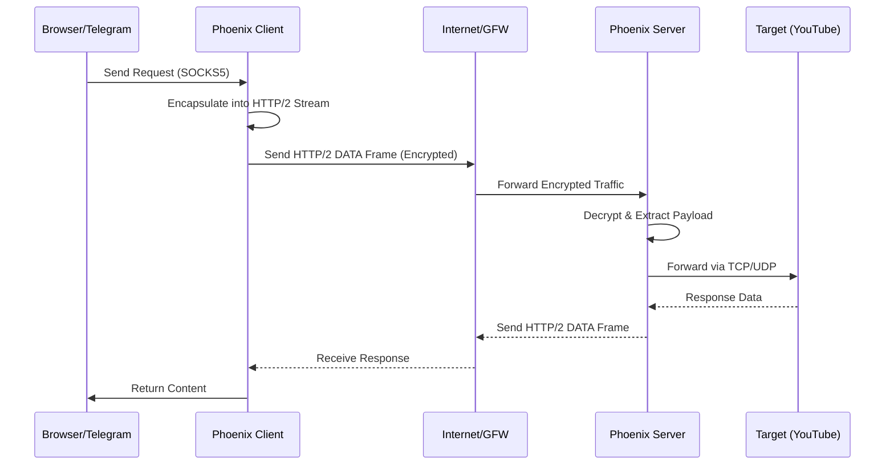

# Phoenix Architecture

## Overview
Phoenix (ققنوس) is a high-performance tunneling tool designed to circumvent advanced censorship systems using **HTTP/2 (h2) multiplexing**.

Unlike traditional VPNs that use distinct protocols (e.g., WireGuard, OpenVPN), Phoenix masquerades as standard HTTP/2 traffic. This makes it incredibly difficult for Deep Packet Inspection (DPI) systems to distinguish from legitimate web browsing.

## Core Components

### 1. Transport Layer (HTTP/2)
Phoenix uses the Go standard library's `net/http` and `golang.org/x/net/http2` packages to establish persistent connections.
- **Multiplexing:** Multiple logical streams (e.g., different website requests inside the tunnel) are carried over a single TCP connection.
- **Header Compression (HPACK):** Reduces overhead for small control messages.
- **Flow Control:** HTTP/2 flow control ensures fair bandwidth usage among streams.

### 2. Security Layer (TLS / mTLS)
Phoenix supports three security modes:

1.  **mTLS (Mutual TLS):**
    - Both Client and Server authenticate each other using **Ed25519** key pairs.
    - Server verifies Client's Public Key against an authorized list.
    - Client pins Server's Public Key to prevent MITM attacks.
    - **Best for:** High security, private access control.

2.  **One-Way TLS (Server-Side Encryption):**
    - Server has a private key and presents a certificate.
    - Client verifies Server's identity (Pinning).
    - Client does NOT authenticate itself (Anonymous).
    - **Best for:** Public proxies, easy client distribution, HTTPS-like security.

3.  **h2c (Cleartext HTTP/2):**
    - No encryption layer (Cleartext).
    - Designed to be used behind a **Reverse Proxy (Nginx/Caddy)** or **CDN (Cloudflare/Gcore)** that handles TLS termination.
    - **Best for:** CDN workers, high-performance setups behind trusted load balancers.

### 3. Resilience Mechanism (Self-Healing)
Phoenix includes active measures to combat unstable networks and "Zombie Connections":

- **Connection Health Check:**
  - The client monitors consecutive request failures.
  - If 3 consecutive failures occur (Timeout/Network Unreachable), the connection is marked as "Unstable".

- **Hard Reset (Circuit Breaker):**
  - Upon detecting instability, the client triggers a **Hard Reset**.
  - It destroys the existing TCP connection pool and HTTP client instance.
  - It creates a fresh `http.Client` to force a new DNS lookup and Handshake.
  - **Debounce:** Prevents "Reset Storms" by ensuring a reset only happens once every 5 seconds.

## Data Flow Diagram

